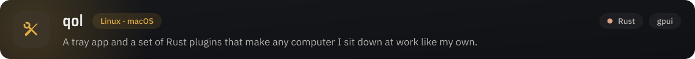
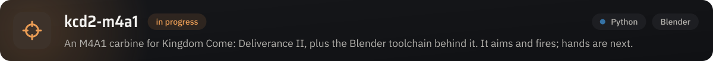

I'm Karsten, a full-stack developer at Brunata in Malmö.
I build across whatever stack the problem needs, from Rust desktop apps to browser extensions and IDE plugins.
Most of what I make starts as a small annoyance at my own desk: a shortcut that only works on one OS, a time log that takes too many clicks, a computer that does not feel like mine.

The biggest of those is [qol](https://github.com/qol-tools/qol), a tray app for Linux and macOS whose plugins, keybindings and settings follow me from machine to machine.
On the side I am building an M4A1 carbine mod for Kingdom Come: Deliverance II, along with the Blender tooling it needs.

[qol-tools on GitHub](https://github.com/qol-tools) · [LinkedIn](https://linkedin.com/in/kmrh47)

  
  
  
  
  
  
  
  
  
  
  

