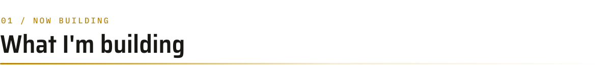
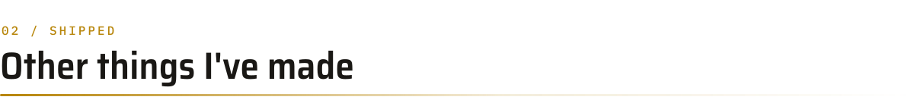
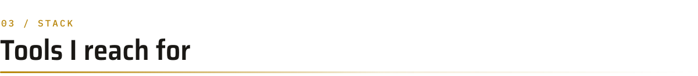
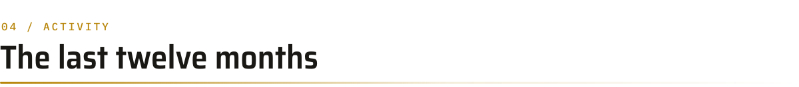

  

  
  

Most of my time goes into [qol](https://github.com/qol-tools/qol): a tray app and a set of Rust plugins that make any computer I sit down at work like my own.
My plugins, keybindings and settings follow me from machine to machine, and each machine is left as I found it when I leave.

 

<picture>
  <source media="(prefers-color-scheme: dark)" srcset="assets/section-01-dark.svg">
  
</picture>

  
  

 

<picture>
  <source media="(prefers-color-scheme: dark)" srcset="assets/section-02-dark.svg">
  
</picture>

  
  
  
  
  
  
  
  

 

<picture>
  <source media="(prefers-color-scheme: dark)" srcset="assets/section-03-dark.svg">
  
</picture>

  

 

<picture>
  <source media="(prefers-color-scheme: dark)" srcset="assets/section-04-dark.svg">
  
</picture>

