I'm Karsten, a full-stack developer based in Malmö.
Most of my time goes into [qol](https://github.com/qol-tools/qol): a tray app and a set of Rust plugins that make any computer I sit down at work like my own.
My plugins, keybindings and settings follow me from machine to machine, and each machine is left as I found it when I leave.

[Download qol-tray](https://github.com/qol-tools/qol/releases/latest) · [qol-tools on GitHub](https://github.com/qol-tools) · [LinkedIn](https://linkedin.com/in/kmrh47)

  
  
  
  
  
  
  
  
  

