Most of what I make starts as a small annoyance at my own desk: a shortcut that only works on one OS, a time log that takes too many clicks, a computer that does not feel like mine.

[qol-tools on GitHub](https://github.com/qol-tools) · [LinkedIn](https://linkedin.com/in/kmrh47)

<a href="https://github.com/qol-tools/qol"></a>

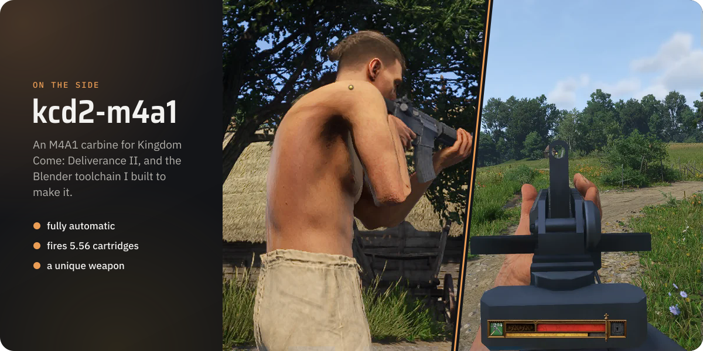

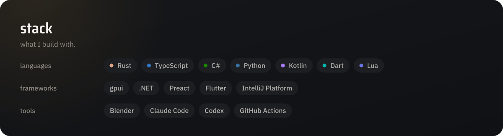

  
  <a href="https://github.com/qol-tools/qol-skills">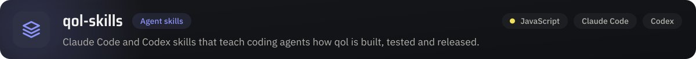</a>
  <a href="https://github.com/qol-tools/pointz">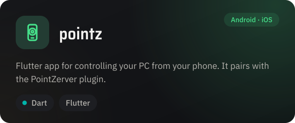</a>
  <a href="https://github.com/KMRH47/bt-quickie">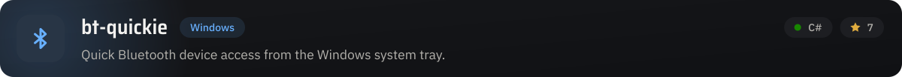</a>
  <a href="https://github.com/KMRH47/paused-changelists">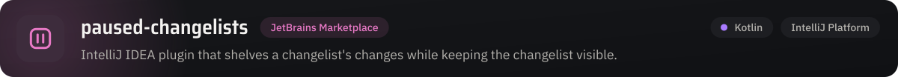</a>
  <a href="https://github.com/KMRH47/conditional-format">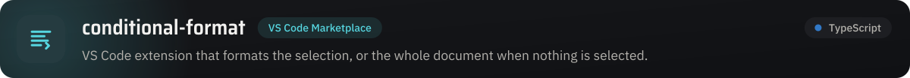</a>
  <a href="https://github.com/KMRH47/windows-like-remap">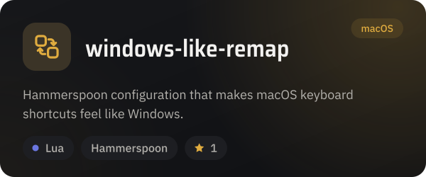</a>
  <a href="https://github.com/KMRH47/fast-youtrack">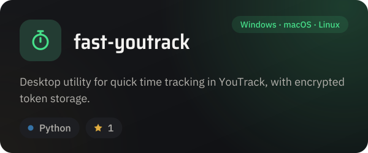</a>
  <a href="https://github.com/KMRH47/github-youtrack-time">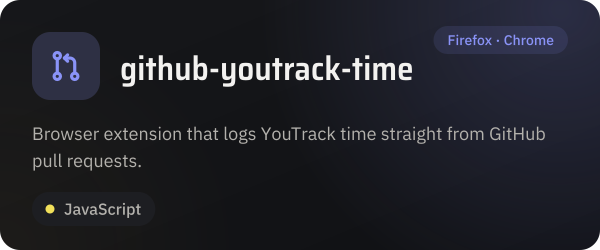</a>

