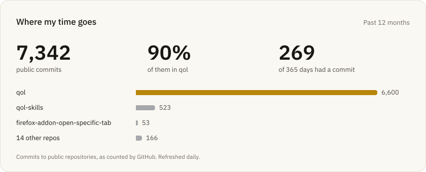
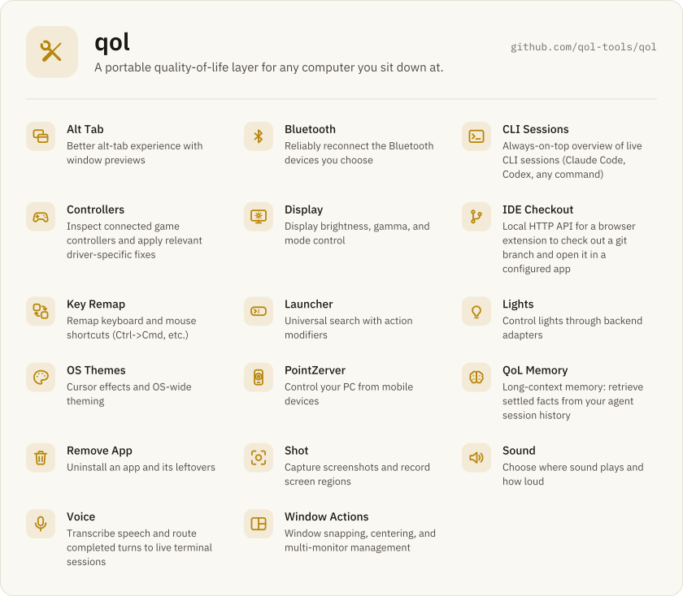

Most of my time goes into [qol](https://github.com/qol-tools/qol): a tray app and a set of plugins, written in Rust, that make any computer I sit down at work like my own.
My plugins, keybindings and settings follow me from machine to machine, and each machine is left as I found it when I leave.

<picture>
  <source media="(prefers-color-scheme: dark)" srcset="assets/time-dark.svg">
  
</picture>

<a href="https://github.com/qol-tools/qol">
  <picture>
    <source media="(prefers-color-scheme: dark)" srcset="assets/qol-dark.svg">
    
  </picture>
</a>

### Also in qol-tools

- [qol-skills](https://github.com/qol-tools/qol-skills): skills for Claude Code and Codex that teach coding agents how qol is built, tested and released.
- [pointz](https://github.com/qol-tools/pointz): a Flutter app for controlling your PC from your phone, paired with the PointZerver plugin.

### Smaller tools

| Repository | What it does |
| --- | --- |
| [bt-quickie](https://github.com/KMRH47/bt-quickie) | Quick Bluetooth device access from the Windows system tray. |
| [paused-changelists](https://github.com/KMRH47/paused-changelists) | IntelliJ IDEA plugin that shelves a changelist's changes while keeping the changelist visible. |
| [windows-like-remap](https://github.com/KMRH47/windows-like-remap) | Hammerspoon configuration that makes macOS keyboard shortcuts feel like Windows. |
| [firefox-addon-open-specific-tab](https://github.com/KMRH47/firefox-addon-open-specific-tab) | Reuses an existing Firefox tab when another application opens its URL. |
| [github-youtrack-time](https://github.com/KMRH47/github-youtrack-time) | Browser extension that logs YouTrack time straight from GitHub pull requests. |
| [conditional-format](https://github.com/KMRH47/conditional-format) | VS Code extension that formats the selection, or the whole document when nothing is selected. |
| [fast-youtrack](https://github.com/KMRH47/fast-youtrack) | Desktop utility for quick time tracking in YouTrack. |
